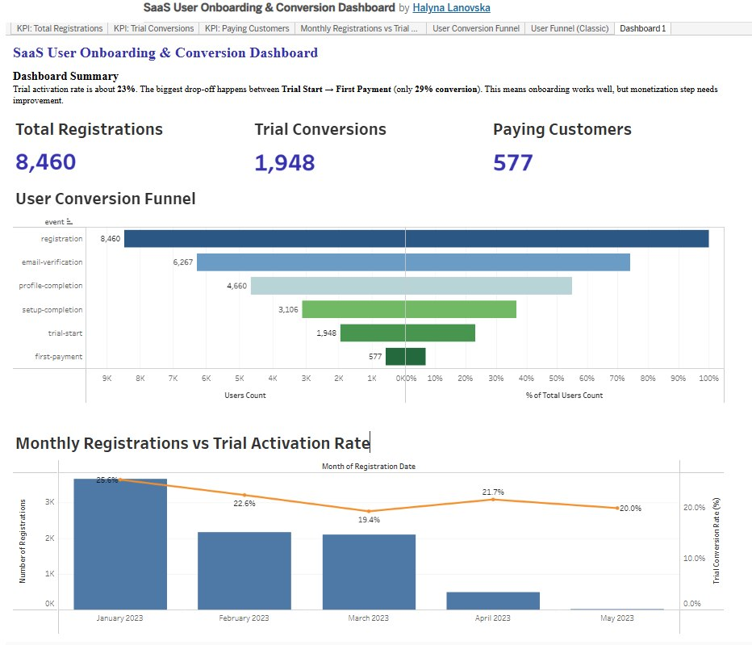

# 📊 Business Revenue Analysis Dashboard (Tableau)

## 📌 Dashboard Preview

  

## 🔗 Interactive Dashboard
👉 [View Tableau Dashboard](https://public.tableau.com/views/BusinessRevenueAnalysisDashboard/RevenuePerformanceOverview)

---

## 🎯 Project Overview

This project analyzes business revenue performance using interactive Tableau dashboards.  
The goal is to identify revenue trends, key growth drivers, and differences across regions and products.

---

## 📊 Key Metrics

- Total Revenue
- Paid Users
- ARPPU (Average Revenue Per Paying User)
- Monthly Revenue Trends

---

## 📈 Analysis Focus

- Revenue growth over time
- Revenue distribution across locations
- Product-level performance
- User monetization trends

---

## 💡 Key Insights

- The USA generates the highest total revenue
- ARPPU shows fluctuations despite growth in users
- Main App and Customer Success are top revenue drivers
- Revenue distribution varies significantly across regions

---

## 🧰 Tools Used

- Tableau
- Data visualization techniques
- KPI analysis
